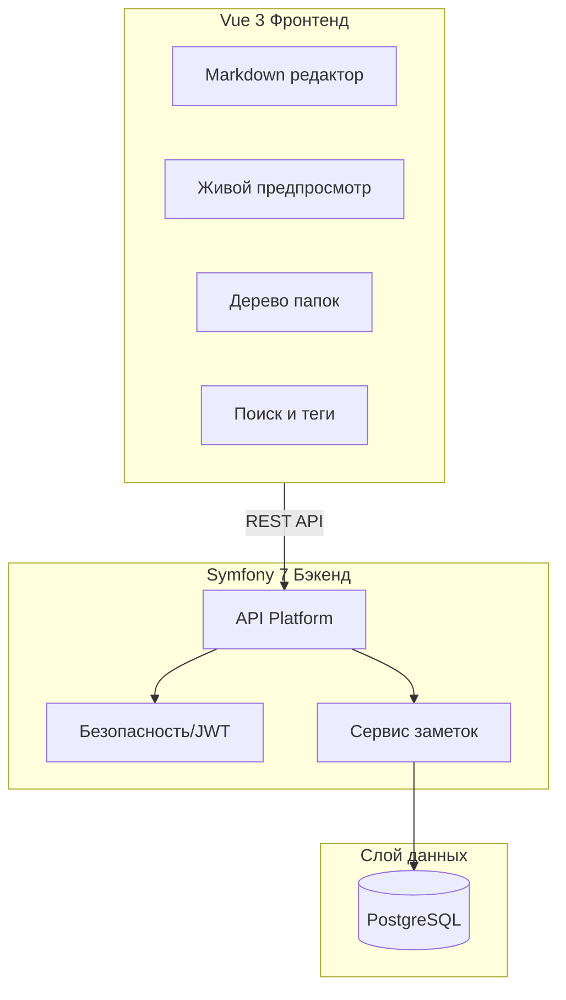
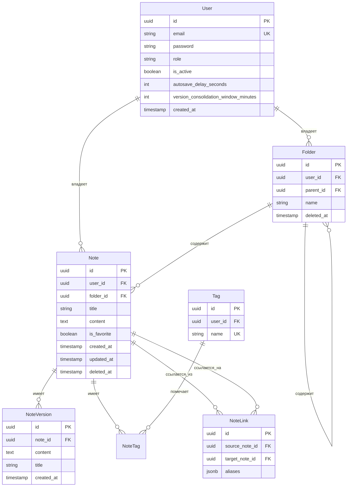
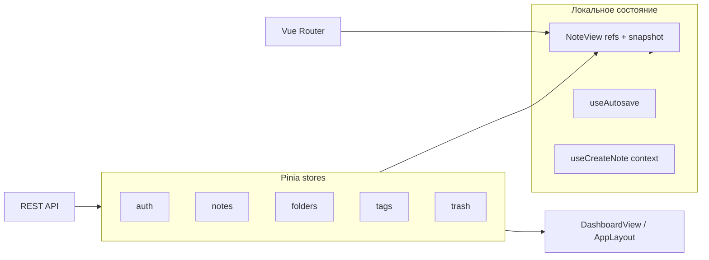

# Персональная база знаний - Архитектура

Многопользовательское веб-приложение для ведения персональной базы знаний с markdown-заметками, иерархическими папками, историей версий, wiki-ссылками, тегами и drag-and-drop организацией.

## Обзор архитектуры



## Стек технологий

### Бэкенд (Symfony 7 + PHP 8.3)

| Компонент | Технология | Назначение |
|-----------|------------|------------|
| Фреймворк | Symfony 7 | Современный PHP фреймворк |
| API | API Platform 3 | REST API с OpenAPI документацией |
| ORM | Doctrine | Абстракция БД, миграции |
| Авторизация | LexikJWTAuthenticationBundle | JWT-аутентификация |
| Валидация | Symfony Validator | Валидация запросов на бэкенде |
| Документация API | Swagger UI (через API Platform) | Интерактивная документация API |
| База данных | PostgreSQL 16 | Основное хранилище данных |

### Фронтенд (Vue 3)

| Компонент | Технология | Назначение |
|-----------|------------|------------|
| Фреймворк | Vue 3 + Composition API | UI фреймворк |
| Язык | TypeScript | Типобезопасность |
| Сборка | Vite | Быстрая разработка и сборка |
| Состояние | Pinia | Управление состоянием |
| Маршрутизация | Vue Router | Клиентская маршрутизация |
| Редактор | Milkdown | Markdown WYSIWYG редактор |
| Утилиты | VueUse | Composables (автосохранение, debounce) |
| Валидация | VeeValidate + Zod | Валидация форм на фронтенде |
| Drag & Drop | vue-draggable-plus | Перетаскивание в дереве |
| Граф связей | vis-network | Локальная визуализация wiki-связей в `NoteView` |
| CSS | Tailwind CSS | Mobile-first утилитарные стили |

## Модель данных



## Структура проекта

```
otus-ai-app/
├── backend/                    # Symfony приложение
│   ├── config/
│   │   ├── packages/          # Конфигурации бандлов
│   │   └── routes.yaml
│   ├── migrations/            # Doctrine миграции
│   ├── src/
│   │   ├── Controller/        # Кастомные контроллеры (при необходимости)
│   │   ├── Entity/            # Doctrine сущности
│   │   │   ├── User.php
│   │   │   ├── Note.php
│   │   │   ├── Folder.php
│   │   │   ├── Tag.php
│   │   │   ├── NoteVersion.php
│   │   │   └── NoteLink.php
│   │   ├── Repository/        # Doctrine репозитории
│   │   ├── Service/
│   │   │   ├── NoteService.php
│   │   │   ├── WikiLinkParser.php
│   │   │   ├── NoteLinkSyncService.php
│   │   │   ├── NoteGraphService.php
│   │   │   └── TrashService.php
│   │   ├── EventSubscriber/   # Doctrine event subscribers
│   │   └── Command/           # Консольные команды (очистка корзины)
│   ├── composer.json
│   └── .env
│
├── frontend/                   # Vue 3 приложение
│   ├── src/
│   │   ├── components/
│   │   │   ├── editor/        # MarkdownEditor, Preview
│   │   │   ├── notes/         # NoteLinksGraphDialog
│   │   │   ├── sidebar/       # FolderTree, TagList, Search
│   │   │   └── common/        # LoadingState, ErrorState, EmptyState, Toast
│   │   ├── composables/
│   │   │   ├── useAutosave.ts
│   │   │   ├── useNotes.ts
│   │   │   └── useFolders.ts
│   │   ├── stores/
│   │   │   ├── auth.ts
│   │   │   ├── notes.ts
│   │   │   ├── folders.ts
│   │   │   └── admin.ts
│   │   ├── views/
│   │   │   ├── LoginView.vue
│   │   │   ├── RegisterView.vue
│   │   │   ├── DashboardView.vue
│   │   │   ├── FavoritesView.vue
│   │   │   ├── NoteView.vue
│   │   │   ├── NotePrintView.vue
│   │   │   ├── TrashView.vue
│   │   │   ├── SettingsView.vue
│   │   │   └── admin/
│   │   │       └── UsersView.vue
│   │   ├── api/
│   │   │   └── client.ts      # Axios/fetch обёртка
│   │   ├── types/
│   │   │   └── index.ts       # TypeScript интерфейсы
│   │   ├── router/
│   │   │   └── index.ts
│   │   ├── App.vue
│   │   └── main.ts
│   ├── package.json
│   ├── tsconfig.json
│   └── vite.config.ts
│
├── docker/
│   ├── nginx/
│   │   └── default.conf
│   └── php/
│       └── Dockerfile
├── docker-compose.yml          # PostgreSQL, PHP-FPM, Nginx
├── docker-compose.prod.yml     # (фаза 16) demo/prod без node-сервиса
├── ARCHITECTURE.md
├── REPORT.md                   # Заметки о рефакторинге и решениях
└── README.md
```

## Ключевые функции

### 1. Markdown редактор с живым предпросмотром

- WYSIWYG markdown редактор на базе Milkdown (ProseMirror)
- Разделённый вид: редактор слева, предпросмотр справа (переключаемый)
- Подсветка синтаксиса для блоков кода
- Поддержка загрузки изображений

### 2. Wiki-ссылки

- Синтаксис: `[[uuid-заметки]]` или `[[uuid-заметки|Отображаемый текст]]` (без префикса `note:`)
- UUID вставляется только через UI: кнопка тулбара, `Ctrl+Alt+W` или ввод `[[` → модалка выбора заметки
- `[[uuid]]` в preview показывает актуальный заголовок целевой заметки; `[[uuid|alias]]` — заданный alias
- В редакторе UUID не отображается: atom-узел `wiki_link` с NodeView; alias редактируется по клику или через кнопку wiki-ссылки (`Ctrl+Alt+W`) — диалог «Редактировать ссылку на заметку»
- Сервис `WikiLinkParser` извлекает UUID и alias; `NoteLinkSyncService` сохраняет `NoteLink` (одна строка на пару source→target, массив `aliases` — порядок вхождений в markdown, `null` = без alias) при POST/PUT/PATCH
- `NoteGraphService` — BFS subgraph для `GET /api/notes/{id}/graph` (depth, direction, max 120 узлов, `frontierNodeIds` при обрезке)
- Двунаправленность: панель обратных ссылок показывает все заметки, ссылающиеся на текущую

### 3. Иерархические папки с Drag-and-Drop

- Вложенная структура папок через `parent_id` самоссылку
- Максимальная глубина вложенности: 3 уровня (валидация на backend)
- Папки сортируются по названию (алфавитный порядок)
- Заметки сортируются по дате последнего обновления (updated_at DESC)
- Перетаскивание заметок между папками
- Перетаскивание папок для изменения вложенности
- Заметки на корневом уровне разрешены (null `folder_id`)

### 4. История версий

- Создание `NoteVersion` при значимых сохранениях (с debounce, не при каждом нажатии)
- Сохранение снимка содержимого и заголовка
- Список версий с временными метками
- Просмотр различий между версиями
- Восстановление из любой версии одним кликом

### 5. Теги

- Связь многие-ко-многим через промежуточную таблицу
- Редактирование тегов в заметке (через запятую или чипы)
- Автодополнение тегов из существующих тегов пользователя
- Фильтрация по тегу в боковой панели
- Страница управления тегами

### 6. Автосохранение с уведомлением

- Composable `useAutosave` с настраиваемым debounce (по умолчанию: 10 секунд; настраивается пользователем в `/settings`)
- Индикатор статуса в UI: «Сохранение...»; после успеха — «Сохранено N секунд/минут назад» с обновлением каждые 5 с (до минуты) и поминутно после (`formatSavedAgo`); при ошибке — «Ошибка сохранения»
- Оптимистичные обновления UI
- Обнаружение конфликтов (опционально: last-write-wins или запрос)

### 7. Корзина (мягкое удаление)

- Временная метка `deleted_at` для мягкого удаления
- Удалённые заметки исключаются из обычных запросов
- Просмотр корзины для обзора удалённых заметок
- Действие восстановления очищает `deleted_at`
- Запланированная Symfony команда удаляет заметки старше 30 дней
- Каскад: удаление папки перемещает содержимое в корзину

## Управление состоянием на фронтенде

Состояние разделено на **глобальное (Pinia)** — данные с сервера и фильтры, общие для layout/views — и **локальное (composables + refs в views)** — черновик редактора, автосохранение, UI-режимы.



### Pinia stores

| Store | Файл | Назначение | Ключевые поля |
|-------|------|------------|---------------|
| `auth` | `stores/auth.ts` | Сессия пользователя | `user`, `token`, `isAuthenticated`, `isAdmin`; `user.settings` / `user.defaults` — задержка автосохранения и окно версионирования |
| `notes` | `stores/notes.ts` | Заметки текущего пользователя | `notes` / `favoriteNotes` — `NoteListItem[]` (без `content`, с `contentPreview`); `currentNote` — полный `Note`; `pagination` / `favoritesPagination`, `isLoading`, `isLoadingMore`, `hasMore`, `isLoadingFavorites`, `isLoadingMoreFavorites`, `favoritesHasMore`, `error`, `favoritesError` |
| `folders` | `stores/folders.ts` | Дерево папок и выбор в сайдбаре | `folders`, `selectedFolderId`, `selectedFolder` |
| `tags` | `stores/tags.ts` | Теги и фильтр в сайдбаре | `tags` (список с учётом контекста папки/фильтра), `selectedTags` |
| `trash` | `stores/trash.ts` | Счётчик корзины в sidebar | `count` |

**Паттерны stores:**
- загрузка с API → запись в `ref`, ошибки в `error` через `getApiErrorMessage`, флаг `loading` / `isLoading`;
- `folders` и `tags` — дедупликация параллельных `fetch*` через in-flight promise;
- `notes.syncNoteInLists` / `syncFavoriteNotes` — локальная синхронизация после `PUT` / переключения избранного без полной перезагрузки списка.

**Паттерны loading / error в UI (фаза 12):**

| Слой | Компонент / composable | Когда |
|------|------------------------|-------|
| Загрузка страницы / панели | `LoadingState` (`compact` в sidebar) | Первичный fetch, пока нет данных |
| Ошибка загрузки | `ErrorState` + кнопка «Повторить» | Сбой API при загрузке списка / заметки |
| Пустой результат | `EmptyState` | Нет данных после успешной загрузки |
| Ошибка мутации (CRUD) | `useAppToast().showError` | Toast с `getApiErrorMessage` |
| Успех мутации | `useAppToast().showSuccess` | Toast |
| Глобально | `Toast` + `ConfirmDialog` в `AppLayout` | Один экземпляр на всё приложение |

Порядок в views: `loading` → `error` → `empty` → контент. Ошибки загрузки — inline (`ErrorState`); ошибки действий — toast.

### Фильтрация dashboard

`AppLayout` следит за `foldersStore.selectedFolderId` и `tagsStore.selectedTags` и перезагружает теги и заметки с согласованными параметрами:

- **папка** → `notesApi.getAll(..., folderId)` и `tagsApi.getAll({ folderId })`;
- **теги** (логика **И**) → `notesApi.filter({ tags })` или комбинация с `folderId`;
- **избранные** — отдельный маршрут `/favorites` (`FavoritesView`); в dashboard и папках показываются вместе с остальными (со звёздочкой на карточке)

Выбор папки/тегов живёт в Pinia; списки заметок и тегов — производное состояние от API-ответов.

### Редактор заметки (`NoteView`)

Комбинация store + локального состояния:

| Слой | Что хранит |
|------|------------|
| Pinia `notes.currentNote` | Загруженная или только что созданная заметка (id для `PUT`) |
| Локальные `ref` | `noteTitle`, `noteContent`, `noteFolderId`, `noteTags`, `viewMode` |
| `savedSnapshot` (let) | Снимок последнего сохранённого состояния для `hasUnsavedChanges()` |
| `persistDraftPromise` | Mutex: один `POST` при создании черновика |
| `useAutosave` | Debounce, статус «сохранение / сохранено / ошибка» |

**Режим черновика** определяется маршрутом: `isDraft = route.name === 'note-new'`. Пока черновик — `currentNote = null`, данные только в локальных `ref`.

**Жизненный цикл сохранения:**

1. **Черновик** — пользователь вводит текст → debounced autosave → один `POST /notes` → `syncSavedSnapshot()` → `router.replace` на `/note/:id`.
2. **Существующая заметка** — `isDraft = false`, `currentNote.id` есть → autosave → `PUT /notes/{id}`.
3. Параметр `autosaveDelaySeconds` из `auth.user.settings` (fallback — env/defaults) задаёт debounce в `useUserSettings` → `useAutosave`.
4. Окно версионирования (`versionConsolidationWindowMinutes`) на фронте **не участвует** в сохранении — только на бэкенде при `PUT` (создание записи в `note_versions`).

**Нормализация текста:** `sanitizeNoteText` (`utils/sanitizeText.ts`) убирает nbsp, zero-width и control chars из `title`/`content` при вводе заголовка и перед autosave в `NoteView`; те же правила в `notesApi.create` / `update`. На бэкенде — `NoteTextSanitizer` в `NoteProcessor` при `POST`/`PUT`/`PATCH`.

**Уход со страницы:** `leaveNote()` → `flushSave()` (тот же путь, что autosave; для черновика — тоже один `POST` через mutex).

**Контекст «Новая заметка»:** composable `useCreateNote` держит module-level `activeNoteContext` (папка и теги открытой заметки), синхронизируемый из `NoteView`. На dashboard контекст берётся из `selectedFolderId` и `selectedTags`.

**Автозаголовок:** пока пользователь не редактировал поле заголовка вручную (`titleWasManuallyEdited`), при изменении тела заметки вызывается `deriveAutoTitleFromMarkdown` (`utils/autoTitle.ts`): первое предложение первого абзаца, обрезка по границе слова до 128 символов. Обновляется только `noteTitle` — редактор не перерисовывается, курсор не сбрасывается.

**Экспорт (фаза 13):** кнопка в тулбаре → меню Markdown / PDF. Перед экспортом — `flushSave()`. **Markdown:** `useNoteExport` + `utils/exportNote.ts` (заголовок `# …`, футер `### Метаданные` + список, wiki → `[\[\[label\]\]]`, `sanitizeNoteText`, `getFolderPath`, скачивание `.md`). **PDF:** маршрут `/notes/:id/print` (`NotePrintView`, без `AppLayout`) — блок метаданных `NoteExportMetadata` + `MarkdownPreview`, `window.print()` (query `auto=1` для автозапуска диалога).

### Горячие клавиши

Глобальный слушатель в `useAppKeyboardShortcuts` (монтируется в `AppLayout`):

| Сочетание | Действие |
|-----------|----------|
| `Ctrl+Alt+N` | Новая заметка (вместо `Ctrl+N` — новое окно браузера) |
| `Ctrl+K` | Фокус на поиск (desktop) / modal поиска (mobile) |
| `?` / `F1` | Справка по горячим клавишам (`KeyboardShortcutsDialog`) |

На странице заметки (`useNoteKeyboardShortcuts`):

| Сочетание | Действие |
|-----------|----------|
| `Ctrl+S` | Немедленное сохранение (`flushSave`) |
| `Ctrl+Alt+M` | Переключение редактирование / просмотр |
| `Ctrl+Alt+B` | Назад к списку заметок |

В редакторе (`useEditorFormattingShortcuts` в `MarkdownEditor`; `Ctrl+B` / `Ctrl+I` — встроенные Milkdown):

| Сочетание | Действие |
|-----------|----------|
| `Ctrl+Shift+H` | Заголовок H2 |
| `Ctrl+Shift+8` / `7` | Маркированный / нумерованный список |
| `Ctrl+Shift+.` | Цитата |
| `Ctrl+Alt+C` | Inline-код |
| `Ctrl+Alt+K` | Ссылка (только в редакторе) |
| `Ctrl+Alt+W` | Wiki-ссылка на заметку |

Подсказки: tooltips на кнопках тулбара редактора и заметки; кнопка «?» в navbar; модальное окно `KeyboardShortcutsDialog` с группами из `constants/keyboardShortcuts.ts` (на macOS подписи `Ctrl` → `⌘`).

### Прочие composables

| Composable | Состояние | Назначение |
|------------|-----------|------------|
| `useAutosave` | `saveStatus`, `saveError`, `lastSavedAt`, in-flight promise | Debounced сохранение; один активный save на экземпляр; `lastSavedAt` для динамического `SaveIndicator` |
| `useNoteVersions` | `versions`, `isLoading` | История версий в панели метаданных (не в общем списке) |
| `useUserSettings` | computed из `authStore.user` | Эффективные задержки автосохранения и defaults |
| `useFavoriteToggle` | — | Обёртка над `notesStore.toggleFavorite` |
| `useAppKeyboardShortcuts` | глобальный `keydown` | Новая заметка, поиск, справка |
| `useKeyboardShortcutsHelp` | `shortcutsHelpVisible` | Открытие/закрытие `KeyboardShortcutsDialog` |
| `useAppToast` | обёртка PrimeVue Toast | `showSuccess` / `showError` / `showInfo` с `getApiErrorMessage` |
| `useInfiniteList` | `sentinelRef` + IntersectionObserver | Подгрузка при прокрутке к sentinel (scroll parent определяется автоматически) |

### Что не хранится во frontend state

- **Версии заметок** — отдельная таблица/API; в Pinia не кэшируются глобально, только в `useNoteVersions` на время открытой панели.
- **Полный список заметок пользователя** — подгружается порциями (infinite scroll на dashboard); избранные — на `/favorites` с тем же паттерном подгрузки

## API Endpoints

### Аутентификация

| Метод | Endpoint | Описание |
|-------|----------|----------|
| POST | `/api/auth/register` | Регистрация пользователя |
| POST | `/api/auth/login` | Получение JWT токена |
| POST | `/api/auth/refresh` | Обновление JWT токена |
| GET | `/api/auth/me` | Получение текущего пользователя (включая `settings` и `defaults`) |
| PATCH | `/api/auth/settings` | Обновление настроек текущего пользователя |
| POST | `/api/auth/change-password` | Смена пароля (текущий + новый; мин. 6 символов; новый ≠ текущий) |

### Заметки

Сериализация: **`note:list`** — collection-ответы (без `content`, с `contentPreview`); **`note:read`** — одна заметка и ответы мутаций (с полным `content`).

| Метод | Endpoint | Описание |
|-------|----------|----------|
| GET | `/api/notes` | Список заметок (`note:list`; пагинация; фильтры: `folder.id`, `isFavorite`, `title`, `content`; сортировка: `order[updatedAt]`, по умолчанию `updatedAt` desc) |
| GET | `/api/notes/search` | Поиск и фильтрация (`note:list`; пагинация; параметры: `q`, `folderId`, `tags[]` — логика **И**, `isFavorite`, `dateFrom`, `dateTo`) |
| POST | `/api/notes` | Создание заметки |
| GET | `/api/notes/{id}` | Получение заметки с содержимым (`note:read`) |
| PUT | `/api/notes/{id}` | Обновление заметки |
| DELETE | `/api/notes/{id}` | Мягкое удаление (перемещение в корзину) |
| PUT | `/api/notes/{id}/move` | Перемещение в папку / изменение порядка |
| GET | `/api/notes/{id}/versions` | Получение истории версий |
| POST | `/api/notes/{id}/restore-version/{versionId}` | Восстановление из версии |
| GET | `/api/notes/{id}/backlinks` | Получение заметок, ссылающихся на эту |
| GET | `/api/notes/{id}/graph` | Локальный subgraph wiki-связей (`depth` 1–3, default 2; `direction`: `both` \| `outgoing` \| `incoming`; max 120 узлов; `truncated`, `frontierNodeIds`) |

Поля **`linkStats`** (`{ incoming, outgoing }`) и **`versionCount`** добавляются в ответ `GET /api/notes/{id}` (`note:read`) через `NoteReadNormalizer`.

**UI (фаза 14.3):** в тулбаре `NoteView` — кнопки «Связанные заметки» (`pi-share-alt`, видна при `linkStats.incoming > 0 || linkStats.outgoing > 0`) и «История версий» (`pi-history`, не на черновиках); обе открывают модалки. Диалог `NoteLinksGraphDialog` (`MODAL_WIDTH.xl`, fullscreen `< md`): force-directed граф, узлы — прямоугольники с названием заметки, alias wiki-ссылок — tooltip при наведении на ребро. `VersionHistoryDialog` — список версий, diff и restore. Сайдбар метаданных: папка, теги, информация (включая `versionCount` из `note:read`). Endpoint `GET /notes/{id}/backlinks` в API сохранён, из UI удалён.

### Папки

| Метод | Endpoint | Описание |
|-------|----------|----------|
| GET | `/api/folders` | Список папок в виде дерева |
| POST | `/api/folders` | Создание папки |
| PUT | `/api/folders/{id}` | Обновление названия папки |
| DELETE | `/api/folders/{id}` | Удаление папки (содержимое в корзину) |
| PUT | `/api/folders/{id}/move` | Перемещение / изменение порядка папки |

### Теги

| Метод | Endpoint | Описание |
|-------|----------|----------|
| GET | `/api/tags` | Список тегов пользователя; опционально `folderId` и `tags[]` — теги заметок в папке / в текущей отфильтрованной выборке |
| POST | `/api/tags` | Создание тега |
| DELETE | `/api/tags/{id}` | Удаление тега |
| GET | `/api/tags/{id}/notes` | Получение заметок с тегом |

### Корзина

| Метод | Endpoint | Описание |
|-------|----------|----------|
| GET | `/api/trash` | Список удалённых заметок |
| POST | `/api/trash/{id}/restore` | Восстановление заметки из корзины |
| DELETE | `/api/trash/{id}` | Окончательное удаление |
| DELETE | `/api/trash` | Очистка корзины |

### Администрирование (требуется ROLE_ADMIN)

| Метод | Endpoint | Описание |
|-------|----------|----------|
| GET | `/api/admin/users` | Список всех пользователей (с пагинацией) |
| GET | `/api/admin/users/{id}` | Получение данных пользователя |
| PATCH | `/api/admin/users/{id}/enable` | Активация аккаунта пользователя |
| PATCH | `/api/admin/users/{id}/disable` | Деактивация аккаунта пользователя |
| DELETE | `/api/admin/users/{id}` | Удаление пользователя и его данных |

## Документация API

- Swagger UI доступен по адресу `/api/docs`
- Спецификация OpenAPI 3.0 автоматически генерируется API Platform
- Интерактивное тестирование прямо из документации

## Валидация

### Валидация на бэкенде (Symfony Validator)

- Ограничения сущностей через PHP атрибуты
- Кастомные валидаторы для бизнес-правил
- Группы валидации для сценариев создания/обновления
- Автоматическая валидация запросов в API Platform

```php
// Пример: валидация сущности Note
#[Assert\NotBlank(message: 'Заголовок обязателен')]
#[Assert\Length(max: 255, maxMessage: 'Заголовок не может превышать 255 символов')]
private string $title;

#[Assert\NotBlank(message: 'Содержимое не может быть пустым')]
private string $content;
```

### Валидация на фронтенде (VeeValidate + Zod)

- Валидация на основе схем с Zod
- Валидация полей в реальном времени
- Валидация формы перед отправкой
- Согласованные сообщения об ошибках с бэкендом

```typescript
// Пример: схема формы заметки
const noteSchema = z.object({
  title: z.string().min(1, 'Заголовок обязателен').max(255),
  content: z.string().min(1, 'Содержимое не может быть пустым'),
  folderId: z.string().uuid().optional(),
  tags: z.array(z.string()).optional(),
});
```

## Пагинация

Все endpoints со списками возвращают пагинированные ответы:

```json
{
  "data": [...],
  "meta": {
    "currentPage": 1,
    "perPage": 20,
    "total": 150,
    "totalPages": 8
  }
}
```

- Размер страницы по умолчанию: 20 элементов
- Настраивается через query параметры `?page=N&perPage=N`
- Максимальный размер страницы: 100 элементов

## Адаптивный дизайн (Mobile-First)

### Контрольные точки

Единая сетка приложения (`useBreakpoints`, `tailwind.config.js`):

| Контрольная точка | Мин. ширина | Назначение |
|-------------------|-------------|------------|
| (по умолчанию) | 0px | Мобильные телефоны |
| `md` | 768px | Планшеты; поиск в navbar → modal |
| `lg` | 1024px | Ноутбуки; `AppSidebar` drawer → фиксированная панель |
| `3xl` | 1400px | Широкие экраны; `NoteMetadata` drawer → фиксированная панель; полная ширина боковых панелей (`w-80`) |

На экранах < 1400px боковые панели уже: `w-64 lg:w-72`.

### Стратегия лейаута

- **Мобильные (< 1024px)**: одна колонка; левый сайдбар — drawer по кнопке в navbar; метаданные заметки — drawer по кнопке в toolbar `NoteView`
- **Ноутбуки (1024–1399px)**: фиксированный левый сайдбар; метаданные — drawer по кнопке в toolbar `NoteView`
- **Широкие экраны (≥ 1400px)**: три колонки на `NoteView` — навигация | редактор | метаданные

### Ключевые адаптивные компоненты

- `AppSidePanel` — общая логика fixed/drawer для левой и правой панелей
- `AppSidebar` — навигация (избранное, папки, теги) + footer с системной навигацией (корзина, админка, аккаунт): drawer `< lg`, fixed `≥ lg`
- `NoteMetadata` — метаданные заметки (только `NoteView`): drawer `< 3xl`, fixed `≥ 3xl`; папка, теги, информация (`versionCount`)
- Список заметок: карточки на всю ширину на мобильных, компактный список на десктопе
- Редактор: полноэкранный на мобильных, split-pane на десктопе
- Модальные окна: fullscreen `< md` для графа и истории версий; по центру на десктопе

## Тема оформления (светлая / тёмная)

- Переключатель в `/settings` (Card «Внешний вид»); выбор хранится в `localStorage` (`theme`: `light` | `dark`), **не** в БД
- При первом визите без сохранённого значения — `prefers-color-scheme`
- Ранний inline-скрипт в `index.html` выставляет класс `dark` на `<html>` до загрузки Vue (без FOUC для Tailwind)
- Composable `useTheme` (singleton): `initTheme()` в `main.ts`, `setTheme` / `toggleTheme` для UI
- Tailwind: `darkMode: 'class'`; semantic-классы в `main.css` (`.app-chrome`, `.text-muted` и др.) с вариантами `dark:`
- PrimeVue: динамическая подмена `#primevue-theme` — `lara-light-blue` / `lara-dark-blue`
- Markdown-редактор и preview следуют глобальной теме через Tailwind `dark:` (отдельная тема Milkdown не используется)

## Варианты развёртывания (Docker)

> Реализация — **фаза 16**. Ниже целевая схема.

| | Разработка | Демо / продакшен |
|---|------------|------------------|
| Compose | `docker-compose.yml` | `docker-compose.prod.yml` (или profile `demo`) |
| Frontend | сервис `node`: `npm install` + Vite dev (`5173`) | **без** `node`; статика из `frontend/dist` |
| API + SPA | API `:8080`, UI `:5173` | один nginx (`APP_PORT`): `/api` → PHP, `/` → `dist` |
| Сборка фронта | не обязательна (HMR) | **один раз** до запуска (`npm run build` в CI или multi-stage образ) |
| Назначение | ежедневная разработка | сдача проекта, демо, staging |

Текущий nginx (`docker/nginx/default.conf`) отдаёт только Symfony `public/`; для demo-режима потребуется конфиг с `try_files` для SPA и проксированием `/api`.

## Роли пользователей

| Роль | Права |
|------|-------|
| `ROLE_USER` | CRUD своих заметок, папок, тегов |
| `ROLE_ADMIN` | Все права пользователя + управление пользователями |

- Первый зарегистрированный пользователь автоматически получает `ROLE_ADMIN`
- Администраторы могут повышать других пользователей до администратора
- Деактивированные пользователи не могут войти в систему

