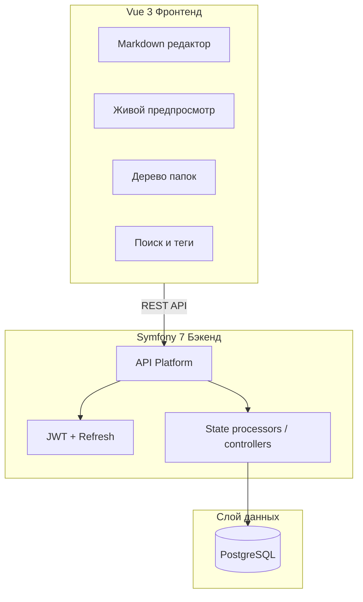
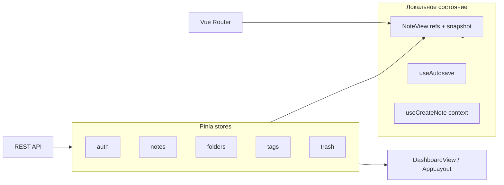

# Персональная база знаний - Архитектура

Многопользовательское веб-приложение для ведения персональной базы знаний с markdown-заметками, иерархическими папками, историей версий, wiki-ссылками, тегами и drag-and-drop организацией.

## Обзор архитектуры



## Стек технологий

### Бэкенд (Symfony 7 + PHP 8.3)

| Компонент | Технология | Назначение |
|-----------|------------|------------|
| Фреймворк | Symfony 7.4 | PHP фреймворк |
| API | API Platform 4.3 | REST API, Hydra/JSON, OpenAPI |
| ORM | Doctrine ORM 3 | Сущности, репозитории, миграции |
| Авторизация | LexikJWTAuthenticationBundle | JWT access token |
| Refresh token | Gesdinet JWTRefreshTokenBundle | Ротация refresh token (`single_use`) |
| CORS | NelmioCorsBundle | CORS для dev/prod |
| Валидация | Symfony Validator | Ограничения сущностей, DTO, группы |
| Документация API | Swagger UI (`/api/docs`) | Каталог endpoints и схем — см. [README.md](./README.md#swagger-ui) |
| База данных | PostgreSQL 16 | Основное хранилище данных |

### Безопасность и изоляция данных

| Механизм | Назначение |
|----------|------------|
| Lexik JWT | Access token; TTL — `JWT_TOKEN_TTL` (сек., default 3600) |
| Gesdinet JWT Refresh | Refresh token; TTL — `JWT_REFRESH_TOKEN_TTL` (сек., default 2592000 = 30 дней); ротация при каждом refresh (`single_use`) |
| `UserOwnedResourceItemQueryExtension` | Item GET/PUT/PATCH/DELETE для `Note`, `Folder`, `Tag`, `NoteVersion`: фильтр `user = currentUser`; чужой UUID → **404** (не 403). Для `Note`/`Folder` на GET — также `deletedAt IS NULL` |
| `ResourceOwnershipAssert` | Проверка владельца в processors на update/delete существующих сущностей |
| `OwnedRelationAssert` | На запись: `folder`, `parent`, `tags` принадлежат текущему пользователю → иначе **422** |
| nginx | `X-Content-Type-Options`, `X-Frame-Options`, `Referrer-Policy` на ответах API |

Допустимые значения пользовательских настроек (`autosaveDelaySeconds`, `versionConsolidationWindowMinutes`) — константы `UserSettingOptions`, используются в `User`, `UpdateUserSettingsDto` и `UserSettingsResolver`.

### Фронтенд (Vue 3)

| Компонент | Технология | Назначение |
|-----------|------------|------------|
| Фреймворк | Vue 3 + Composition API | UI фреймворк |
| Язык | TypeScript | Типобезопасность |
| Сборка | Vite 6 | Dev-сервер и production-сборка |
| UI | PrimeVue 4 + PrimeIcons | Компоненты, toast, confirm, формы |
| Состояние | Pinia | Управление состоянием |
| Маршрутизация | Vue Router 4 | Клиентская маршрутизация |
| Редактор / preview | Milkdown 7.9 | WYSIWYG markdown и read-only preview |
| Утилиты | VueUse | Composables (debounce, breakpoints и др.) |
| Валидация | VeeValidate + Zod | Валидация форм на фронтенде |
| Drag & Drop | HTML5 DnD | Перетаскивание заметок из списка на папки в сайдбаре (desktop); диалог на touch |
| Граф связей | vis-network | Локальная визуализация wiki-связей в `NoteView` |
| CSS | Tailwind CSS 3 | Mobile-first утилитарные стили |
| Тесты | Vitest | Unit-тесты утилит, stores, API client |

## Модель данных

```mermaid
erDiagram
    User ||--o{ Note : владеет
    User ||--o{ Folder : владеет
    Folder ||--o{ Folder : содержит
    Folder ||--o{ Note : содержит
    Note ||--o{ NoteVersion : имеет
    Note ||--o{ NoteTag : имеет
    Tag ||--o{ NoteTag : помечает
    Note ||--o{ NoteLink : ссылается_из
    Note ||--o{ NoteLink : ссылается_на

    User {
        uuid id PK
        string email UK
        string password
        json roles
        boolean is_active
        int autosave_delay_seconds nullable
        int version_consolidation_window_minutes nullable
        timestamp created_at
    }
    
    Folder {
        uuid id PK
        uuid user_id FK
        uuid parent_id FK
        string name
        string icon nullable
        timestamp deleted_at
    }
    
    Note {
        uuid id PK
        uuid user_id FK
        uuid folder_id FK
        string title
        text content
        boolean is_favorite
        timestamp created_at
        timestamp updated_at
        timestamp deleted_at
    }
    
    NoteVersion {
        uuid id PK
        uuid note_id FK
        text content
        string title
        timestamp created_at
    }
    
    Tag {
        uuid id PK
        uuid user_id FK
        string name UK
    }
    
    NoteLink {
        uuid id PK
        uuid source_note_id FK
        uuid target_note_id FK
        jsonb aliases
    }
```

## Структура проекта

```
otus-ai-app/
├── backend/                    # Symfony приложение
│   ├── config/
│   │   ├── packages/          # Конфигурации бандлов (api_platform, security, jwt, …)
│   │   └── routes/            # Маршруты API Platform, JWT login
│   ├── migrations/            # Doctrine миграции
│   ├── src/
│   │   ├── Controller/        # Auth, Admin, WikiLink, NoteSearch
│   │   ├── Dto/               # ChangePasswordDto, UpdateUserSettingsDto, …
│   │   ├── Entity/            # User, Note, Folder, Tag, NoteVersion, NoteLink, RefreshToken
│   │   ├── OpenApi/           # CustomEndpointsOpenApiFactory — auth/admin/wiki в Swagger
│   │   ├── Repository/
│   │   ├── Security/          # UserChecker, ResourceOwnershipAssert, OwnedRelationAssert
│   │   ├── Serializer/        # NoteListNormalizer, NoteReadNormalizer, …
│   │   ├── Service/           # WikiLinkParser, NoteLinkSyncService, NoteGraphService, …
│   │   ├── State/             # Processors и providers API Platform
│   │   ├── DemoSeed/          # Demo seed (3 вселенные)
│   │   ├── EventListener/     # JWTCreatedListener, NoteNotFoundExceptionListener
│   │   └── Command/           # reset-schema, create-admin, seed-demo-data, cleanup-trash
│   ├── tests/                 # PHPUnit (Functional, Integration)
│   └── composer.json
│
├── frontend/                   # Vue 3 приложение
│   ├── src/
│   │   ├── api/               # client.ts (fetch + JWT refresh), auth, notes, folders, …
│   │   ├── components/
│   │   │   ├── editor/        # MarkdownEditor, MarkdownPreview, wiki-link nodes
│   │   │   ├── notes/         # NoteLinksGraphDialog, MoveNoteToFolderDialog
│   │   │   ├── sidebar/       # FolderTree, TagsPanel
│   │   │   ├── layout/        # AppLayout, AppSidebar, NoteMetadata
│   │   │   └── common/        # LoadingState, ErrorState, EmptyState, SaveIndicator
│   │   ├── composables/       # useAutosave, useNoteExport, useMoveNoteToFolder, …
│   │   ├── stores/            # auth, notes, folders, tags, trash (+ resetUserStores)
│   │   ├── views/             # Dashboard, NoteView, Trash, Settings, admin/AdminUsersView, …
│   │   ├── utils/             # hydra, sanitizeText, exportNote, noteGraph, …
│   │   ├── types/
│   │   └── router/
│   ├── package.json
│   └── vite.config.ts
│
├── docker/
│   ├── nginx/
│   └── php/
├── volumes/                    # node_modules (Docker volume для frontend)
├── docker-compose.yml          # (фаза 21) prod/demo по умолчанию: postgres, php, nginx, cron
├── docker-compose.dev.yml      # (фаза 21) overlay для разработки: + node (Vite)
├── ARCHITECTURE.md
├── demoseed.md
├── REPORT.md
└── README.md
```

## Ключевые функции

### 1. Markdown редактор с живым предпросмотром

- WYSIWYG markdown редактор на базе Milkdown (ProseMirror)
- Разделённый вид: редактор слева, предпросмотр справа (переключаемый)
- Подсветка синтаксиса для блоков кода
- Поддержка загрузки изображений

### 2. Wiki-ссылки

- Синтаксис: `[[uuid-заметки]]` или `[[uuid-заметки|Отображаемый текст]]` (без префикса `note:`)
- UUID вставляется только через UI: кнопка тулбара, `Ctrl+Alt+W` или ввод `[[` → модалка выбора заметки
- `[[uuid]]` в preview показывает актуальный заголовок целевой заметки; `[[uuid|alias]]` — заданный alias
- В редакторе UUID не отображается: atom-узел `wiki_link` с NodeView; alias редактируется по клику или через кнопку wiki-ссылки (`Ctrl+Alt+W`) — диалог «Редактировать ссылку на заметку»
- Сервис `WikiLinkParser` извлекает UUID и alias; `NoteLinkSyncService` сохраняет `NoteLink` (одна строка на пару source→target, массив `aliases` — порядок вхождений в markdown, `null` = без alias) при **POST** и при **PUT/PATCH**, если изменился `content` (PATCH только `isFavorite` / `folder` / `tags` — sync не вызывается)
- `NoteGraphService` — BFS subgraph для `GET /api/notes/{id}/graph` (depth, direction, max 120 узлов, `frontierNodeIds` при обрезке). Связи загружаются batch-запросами `NoteLinkRepository::findLinksForNodes`: BFS по уровням (до `depth` SQL) + один batch по всем узлам subgraph для рёбер и frontier (вместо N запросов на узел)
- Двунаправленность: панель обратных ссылок показывает все заметки, ссылающиеся на текущую

### 3. Иерархические папки и перемещение заметок

- Вложенная структура папок через `parent_id` самоссылку
- Максимальная глубина вложенности: 3 уровня (валидация на backend)
- Папки сортируются по названию (алфавитный порядок); перетаскивание папок **не** используется (фаза 5)
- Заметки сортируются по дате последнего обновления (updated_at DESC)
- Смена папки заметки: `FolderSelector` в метаданных (`NoteView`); drag-and-drop из списка (`NoteCard`) в дерево сайдбара; на touch — `MoveNoteToFolderDialog`. Общая логика — `useMoveNoteToFolder` + `notesStore.moveNoteToFolder` (**PATCH** `folder` на `/api/notes/{id}`)
- Заметки на корневом уровне разрешены (`folder = null`)
- Удаление папки — **soft delete** (`deletedAt` на `Folder`); папка исчезает из `/api/folders/tree`, заметки внутри **не** переносятся в корзину автоматически

### 4. История версий

- Создание `NoteVersion` при значимых сохранениях (с debounce, не при каждом нажатии)
- Сохранение снимка содержимого и заголовка
- Список версий с временными метками
- Просмотр различий между версиями
- Восстановление из любой версии одним кликом

### 5. Теги

- Связь многие-ко-многим через промежуточную таблицу
- Редактирование тегов в заметке (через запятую или чипы)
- Автодополнение тегов из существующих тегов пользователя
- Фильтрация по тегу в боковой панели
- Страница управления тегами

### 6. Автосохранение с уведомлением

- Composable `useAutosave` с настраиваемым debounce (по умолчанию: 10 секунд; настраивается пользователем в `/settings`)
- Индикатор статуса в UI: «Сохранение...»; после успеха — «Сохранено N секунд/минут назад» с обновлением каждые 5 с (до минуты) и поминутно после (`formatSavedAgo`); при ошибке — «Ошибка сохранения»
- Оптимистичные обновления UI
- Обнаружение конфликтов (опционально: last-write-wins или запрос)

### 7. Корзина (мягкое удаление)

- `DELETE /api/notes/{id}` на активной заметке — soft delete (`deleted_at`)
- Повторный `DELETE /api/notes/{id}` на заметке уже в корзине — **окончательное** удаление
- `GET /api/notes/trash` — список удалённых заметок
- `POST /api/notes/{id}/restore` — восстановление
- `POST /api/notes/trash/empty` — очистка корзины
- Запланированная Symfony-команда `app:cleanup-trash` удаляет заметки из корзины старше `TRASH_RETENTION_DAYS` (default 30, cron ежедневно)

## Управление состоянием на фронтенде

Состояние разделено на **глобальное (Pinia)** — данные с сервера и фильтры, общие для layout/views — и **локальное (composables + refs в views)** — черновик редактора, автосохранение, UI-режимы.

**HTTP-клиент:** `api/client.ts` — native Fetch API (не axios), Bearer JWT, автоматический refresh на 401 через `/api/auth/refresh`, затем повтор запроса; при неудаче — logout.



### Pinia stores

| Store | Файл | Назначение | Ключевые поля |
|-------|------|------------|---------------|
| `auth` | `stores/auth.ts` | Сессия пользователя | `user`, `token`, `isAuthenticated`, `isAdmin`; `user.settings` / `user.defaults` — задержка автосохранения и окно версионирования |
| `notes` | `stores/notes.ts` | Заметки текущего пользователя | `notes` / `favoriteNotes` — `NoteListItem[]` (без `content`, с `contentPreview`); `currentNote` — полный `Note`; `pagination` / `favoritesPagination`, `isLoading`, `isLoadingMore`, `hasMore`, `isLoadingFavorites`, `isLoadingMoreFavorites`, `favoritesHasMore`, `error`, `favoritesError` |
| `folders` | `stores/folders.ts` | Дерево папок и выбор в сайдбаре | `folders`, `selectedFolderId`, `selectedFolder` |
| `tags` | `stores/tags.ts` | Теги и фильтр в сайдбаре | `tags` (список с учётом контекста папки/фильтра), `selectedTags` |
| `trash` | `stores/trash.ts` | Счётчик корзины в sidebar | `count` |

**Паттерны stores:**
- загрузка с API → запись в `ref`, ошибки в `error` через `getApiErrorMessage`, флаг `loading` / `isLoading`;
- `folders` и `tags` — дедупликация параллельных `fetch*` через in-flight promise;
- `notes.syncNoteInLists` / `syncFavoriteNotes` — локальная синхронизация после `PUT` / переключения избранного без полной перезагрузки списка.

**Паттерны loading / error в UI (фаза 12):**

| Слой | Компонент / composable | Когда |
|------|------------------------|-------|
| Загрузка страницы / панели | `LoadingState` (`compact` в sidebar) | Первичный fetch, пока нет данных |
| Ошибка загрузки | `ErrorState` + кнопка «Повторить» | Сбой API при загрузке списка / заметки |
| Пустой результат | `EmptyState` | Нет данных после успешной загрузки |
| Ошибка мутации (CRUD) | `useAppToast().showError` | Toast с `getApiErrorMessage` |
| Успех мутации | `useAppToast().showSuccess` | Toast |
| Глобально | `Toast` + `ConfirmDialog` в `AppLayout` | Один экземпляр на всё приложение |

Порядок в views: `loading` → `error` → `empty` → контент. Ошибки загрузки — inline (`ErrorState`); ошибки действий — toast.

### Фильтрация dashboard

`AppLayout` следит за `foldersStore.selectedFolderId` и `tagsStore.selectedTags` и перезагружает теги и заметки с согласованными параметрами:

- **папка** → `notesApi.getAll(..., folderId)` и `tagsApi.getAll({ folderId })`;
- **теги** (логика **И**) → `notesApi.filter({ tags })` или комбинация с `folderId`;
- **избранные** — отдельный маршрут `/favorites` (`FavoritesView`); в dashboard и папках показываются вместе с остальными (со звёздочкой на карточке)

Выбор папки/тегов живёт в Pinia; списки заметок и тегов — производное состояние от API-ответов.

### Редактор заметки (`NoteView`)

Комбинация store + локального состояния:

| Слой | Что хранит |
|------|------------|
| Pinia `notes.currentNote` | Загруженная или только что созданная заметка (id для `PUT`) |
| Локальные `ref` | `noteTitle`, `noteContent`, `noteFolderId`, `noteTags`, `viewMode` |
| `savedSnapshot` (let) | Снимок последнего сохранённого состояния для `hasUnsavedChanges()` |
| `persistDraftPromise` | Mutex: один `POST` при создании черновика |
| `useAutosave` | Debounce, статус «сохранение / сохранено / ошибка» |

**Режим черновика** определяется маршрутом: `isDraft = route.name === 'note-new'`. Пока черновик — `currentNote = null`, данные только в локальных `ref`.

**Жизненный цикл сохранения:**

1. **Черновик** — пользователь вводит текст → debounced autosave → один `POST /notes` (с непустым `content`, как на фронте `hasNoteBody`) → `syncSavedSnapshot()` → `router.replace` на `/note/:id`.
2. **Существующая заметка** — `isDraft = false`, `currentNote.id` есть → autosave → `PUT /notes/{id}`.
3. Параметр `autosaveDelaySeconds` из `auth.user.settings` (fallback — env/defaults) задаёт debounce в `useUserSettings` → `useAutosave`.
4. Окно версионирования (`versionConsolidationWindowMinutes`) на фронте **не участвует** в сохранении — только на бэкенде при **`PUT`** (создание записи в `note_versions`). **`PATCH`** — частичное обновление метаданных (избранное, папка, теги) **без** новой версии; autosave редактора использует **`PUT`** с полным телом заметки.

**Нормализация текста:** `sanitizeNoteText` (`utils/sanitizeText.ts`) убирает nbsp, zero-width и control chars из `title`/`content` при вводе заголовка и перед autosave в `NoteView`; те же правила в `notesApi.create` / `update`. На бэкенде — `NoteTextSanitizer` в `NoteProcessor` при `POST`/`PUT`/`PATCH`.

**Уход со страницы:** `leaveNote()` → `flushSave()` (тот же путь, что autosave; для черновика — тоже один `POST` через mutex).

**Контекст «Новая заметка»:** composable `useCreateNote` держит module-level `activeNoteContext` (папка и теги открытой заметки), синхронизируемый из `NoteView`. На dashboard контекст берётся из `selectedFolderId` и `selectedTags`.

**Автозаголовок:** пока пользователь не редактировал поле заголовка вручную (`titleWasManuallyEdited`), при изменении тела заметки вызывается `deriveAutoTitleFromMarkdown` (`utils/autoTitle.ts`): первое предложение первого абзаца, обрезка по границе слова до 128 символов. Обновляется только `noteTitle` — редактор не перерисовывается, курсор не сбрасывается.

**Экспорт (фаза 13):** кнопка в тулбаре → меню Markdown / PDF. Перед экспортом — `flushSave()`. **Markdown:** `useNoteExport` + `utils/exportNote.ts` (заголовок `# …`, футер `### Метаданные` + список, wiki → `[\[\[label\]\]]`, `sanitizeNoteText`, `getFolderPath`, скачивание `.md`). **PDF:** маршрут `/notes/:id/print` (`NotePrintView`, без `AppLayout`) — блок метаданных `NoteExportMetadata` + `MarkdownPreview`, `window.print()` (query `auto=1` для автозапуска диалога).

### Горячие клавиши

Глобальный слушатель в `useAppKeyboardShortcuts` (монтируется в `AppLayout`):

| Сочетание | Действие |
|-----------|----------|
| `Ctrl+Alt+N` | Новая заметка (вместо `Ctrl+N` — новое окно браузера) |
| `Ctrl+K` | Фокус на поиск (desktop) / modal поиска (mobile) |
| `?` / `F1` | Справка по горячим клавишам (`KeyboardShortcutsDialog`) |

На странице заметки (`useNoteKeyboardShortcuts`):

| Сочетание | Действие |
|-----------|----------|
| `Ctrl+S` | Немедленное сохранение (`flushSave`) |
| `Ctrl+Alt+M` | Переключение редактирование / просмотр |
| `Ctrl+Alt+B` | Назад к списку заметок |

В редакторе (`useEditorFormattingShortcuts` в `MarkdownEditor`; `Ctrl+B` / `Ctrl+I` — встроенные Milkdown):

| Сочетание | Действие |
|-----------|----------|
| `Ctrl+Shift+H` | Заголовок H2 |
| `Ctrl+Shift+8` / `7` | Маркированный / нумерованный список |
| `Ctrl+Shift+.` | Цитата |
| `Ctrl+Alt+C` | Inline-код |
| `Ctrl+Alt+K` | Ссылка (только в редакторе) |
| `Ctrl+Alt+W` | Wiki-ссылка на заметку |

Подсказки: tooltips на кнопках тулбара редактора и заметки; кнопка «?» в navbar; модальное окно `KeyboardShortcutsDialog` с группами из `constants/keyboardShortcuts.ts` (на macOS подписи `Ctrl` → `⌘`).

### Прочие composables

| Composable | Состояние | Назначение |
|------------|-----------|------------|
| `useAutosave` | `saveStatus`, `saveError`, `lastSavedAt`, in-flight promise | Debounced сохранение; один активный save на экземпляр; `lastSavedAt` для динамического `SaveIndicator` |
| `useNoteVersions` | `versions`, `isLoading` | История версий в панели метаданных (не в общем списке) |
| `useUserSettings` | computed из `authStore.user` | Эффективные задержки автосохранения и defaults |
| `useFavoriteToggle` | — | Обёртка над `notesStore.toggleFavorite` |
| `useAppKeyboardShortcuts` | глобальный `keydown` | Новая заметка, поиск, справка |
| `useKeyboardShortcutsHelp` | `shortcutsHelpVisible` | Открытие/закрытие `KeyboardShortcutsDialog` |
| `useAppToast` | обёртка PrimeVue Toast | `showSuccess` / `showError` / `showInfo` с `getApiErrorMessage` |
| `useInfiniteList` | `sentinelRef` + IntersectionObserver | Подгрузка при прокрутке к sentinel (scroll parent определяется автоматически) |

### Что не хранится во frontend state

- **Версии заметок** — отдельная таблица/API; в Pinia не кэшируются глобально, только в `useNoteVersions` на время открытой панели.
- **Полный список заметок пользователя** — подгружается порциями (infinite scroll на dashboard); избранные — на `/favorites` с тем же паттерном подгрузки

## Валидация

### Валидация на бэкенде (Symfony Validator)

- Ограничения сущностей через PHP атрибуты
- Кастомные валидаторы для бизнес-правил
- Группы валидации для сценариев создания/обновления
- Автоматическая валидация запросов в API Platform

```php
// Пример: валидация сущности Note
#[Assert\NotBlank(message: 'Заголовок обязателен')]
#[Assert\Length(max: 255, maxMessage: 'Заголовок не может превышать 255 символов')]
private string $title;

#[Assert\NotBlank(message: 'Содержимое не может быть пустым')]
private string $content;
```

### Валидация на фронтенде (VeeValidate + Zod)

- Валидация на основе схем с Zod
- Валидация полей в реальном времени
- Валидация формы перед отправкой
- Согласованные сообщения об ошибках с бэкендом

```typescript
// Пример: схема формы заметки
const noteSchema = z.object({
  title: z.string().min(1, 'Заголовок обязателен').max(255),
  content: z.string().min(1, 'Содержимое не может быть пустым'),
  folderId: z.string().uuid().optional(),
  tags: z.array(z.string()).optional(),
});
```

## Пагинация

Два формата ответов для коллекций:

**1. API Platform (Hydra)** — `GET /api/notes`, `/api/folders`, `/api/tags`, `/api/notes/trash`:

```json
{
  "member": [...],
  "totalItems": 150,
  "view": { "first": "…", "last": "…", "next": "…" }
}
```

Фронтенд парсит через `parseHydraCollection()` (`utils/hydra.ts`); query-параметры: `page`, `itemsPerPage` (default 20, max 100).

**2. Кастомный JSON** — `GET /api/notes/search`, `GET /api/admin/users`:

```json
{
  "data": [...],
  "meta": {
    "currentPage": 1,
    "perPage": 20,
    "total": 150,
    "totalPages": 8
  }
}
```

Query: `page`, `perPage` (search) или `perPage` (admin).

## Адаптивный дизайн (Mobile-First)

### Контрольные точки

Единая сетка приложения (`useBreakpoints`, `tailwind.config.js`):

| Контрольная точка | Мин. ширина | Назначение |
|-------------------|-------------|------------|
| (по умолчанию) | 0px | Мобильные телефоны |
| `md` | 768px | Планшеты; поиск в navbar → modal |
| `lg` | 1024px | Ноутбуки; `AppSidebar` drawer → фиксированная панель |
| `3xl` | 1400px | Широкие экраны; `NoteMetadata` drawer → фиксированная панель; полная ширина боковых панелей (`w-80`) |

На экранах < 1400px боковые панели уже: `w-64 lg:w-72`.

### Стратегия лейаута

- **Мобильные (< 1024px)**: одна колонка; левый сайдбар — drawer по кнопке в navbar; метаданные заметки — drawer по кнопке в toolbar `NoteView`
- **Ноутбуки (1024–1399px)**: фиксированный левый сайдбар; метаданные — drawer по кнопке в toolbar `NoteView`
- **Широкие экраны (≥ 1400px)**: три колонки на `NoteView` — навигация | редактор | метаданные

### Ключевые адаптивные компоненты

- `AppSidePanel` — общая логика fixed/drawer для левой и правой панелей
- `AppSidebar` — навигация (избранное, папки, теги) + footer с системной навигацией (корзина, админка, аккаунт): drawer `< lg`, fixed `≥ lg`
- `NoteMetadata` — метаданные заметки (только `NoteView`): drawer `< 3xl`, fixed `≥ 3xl`; папка, теги, информация (`versionCount`)
- Список заметок: карточки на всю ширину на мобильных, компактный список на десктопе
- Редактор: полноэкранный на мобильных; на десктопе — WYSIWYG (`edit`) или read-only превью (`preview`), без split-pane
- Модальные окна: fullscreen `< md` для графа и истории версий; по центру на десктопе

## Тема оформления (светлая / тёмная)

- Переключатель в `/settings` (Card «Внешний вид»); выбор хранится в `localStorage` (`theme`: `light` | `dark`), **не** в БД
- При первом визите без сохранённого значения — `prefers-color-scheme`
- Ранний inline-скрипт в `index.html` выставляет класс `dark` на `<html>` до загрузки Vue (без FOUC для Tailwind)
- Composable `useTheme` (singleton): `initTheme()` в `main.ts`, `setTheme` / `toggleTheme` для UI
- Tailwind: `darkMode: 'class'`; semantic-классы в `main.css` (`.app-chrome`, `.text-muted` и др.) с вариантами `dark:`
- PrimeVue: динамическая подмена `#primevue-theme` — `lara-light-blue` / `lara-dark-blue`
- Markdown-редактор и preview следуют глобальной теме через Tailwind `dark:` (отдельная тема Milkdown не используется)

## Варианты развёртывания (Docker)

> Реализация: **фаза 19** (single-user), **фаза 21** (prod `docker-compose.yml`). Ниже целевая схема.

| | Демо / продакшен (по умолчанию) | Разработка |
|---|------------|------------------|
| Compose | `docker-compose.yml` | `docker-compose.dev.yml` (overlay) или profile `dev` |
| Запуск | `docker compose up -d` — готовое приложение по ТЗ | `docker compose -f docker-compose.yml -f docker-compose.dev.yml up -d` |
| Frontend | **без** `node`; статика из `frontend/dist` | сервис `node`: `npm install` + Vite dev (`5173`) |
| API + SPA | один nginx (`APP_PORT`): `/api` → PHP, `/` → `dist` | API `:8080`, UI `:5173` (как сейчас) |
| Сборка фронта | `make frontend-build` / CI [`build.yml`](.github/workflows/build.yml) → ветка `dist` | не обязательна (HMR) |
| Назначение | сдача проекта, демо, staging | ежедневная разработка |

Текущий `docker-compose.yml` — **prod/demo по умолчанию** (без `node`; SPA из `frontend/dist` в образе `nginx`, entrypoint php: migrate + demo seed / ensure-single-user). Dev: `docker-compose.dev.yml` + Vite `:5173`. Сборка `dist` — локально `make frontend-build` или CI (`.github/workflows/build.yml` → ветка `dist`).

### Режим аутентификации

| | Multi-user (default) | Single-user |
|---|---------------------|-------------|
| Env | корневой `.env`: `APP_AUTH_ENABLED=true` | корневой `.env`: `APP_AUTH_ENABLED=false` (+ `VITE_*` из compose) |
| API | JWT (Lexik) | `SingleUserAuthenticator` — каждый запрос от имени `SINGLE_USER_EMAIL` |
| Пользователь | demo seed (`--if-missing`) / регистрация / `app:create-admin` | `app:ensure-single-user` (пустая база) |
| UI | login, register, admin, logout | сразу dashboard; admin и пароль скрыты |

## Консольные команды

| Команда | Назначение |
|---------|------------|
| `app:reset-schema` | Удалить схему БД и применить миграции заново |
| `app:ensure-single-user` | Создать единственного пользователя для `APP_AUTH_ENABLED=false` (idempotent) |
| `app:create-admin` | Создать администратора из `ADMIN_EMAIL` / `ADMIN_PASSWORD` в `.env` |
| `app:seed-demo-data` | Загрузить demo-данные (3 вселенные); `--force` — пересоздать; `--if-missing` — пропустить, если уже есть (bootstrap prod/demo) |
| `app:cleanup-trash` | Удалить заметки из корзины старше `TRASH_RETENTION_DAYS` (default 30, cron ежедневно) |

### Demo seed (`app:seed-demo-data`)

Три изолированных пользователя с контентом на русском:

| Email | Вселенная | Заметок |
|-------|-----------|---------|
| `hogwarts@demo.local` | Гарри Поттер | ~40 |
| `westeros@demo.local` | Игра престолов | ~47 |
| `witcher@demo.local` | Ведьмак | ~39 |

Пароль для всех: `demo1234`. Роль: `ROLE_USER`. Администратор создаётся отдельно (`app:create-admin`).

**Структура кода:** классы в `backend/src/DemoSeed/`; определения вселенных — `DemoSeed/Universe/*Universe.php`. Wiki-ссылки в контенте задаются плейсхолдерами `{{link:key}}` / `{{link:key|alias}}`, резолвятся в UUID при seed. При правке контента — перегенерация через `python3 backend/tools/build_universes.py` (встроенная проверка на смешение латиницы и кириллицы в одном слове).

**Типичный сценарий dev/demo:**

```bash
docker compose exec php php bin/console app:reset-schema
docker compose exec php php bin/console app:seed-demo-data
docker compose exec php php bin/console app:create-admin
```

## Роли пользователей

| Роль | Права |
|------|-------|
| `ROLE_USER` | CRUD своих заметок, папок, тегов |
| `ROLE_ADMIN` | Все права пользователя + `/api/admin/*` (управление пользователями) |

- Первый зарегистрированный пользователь автоматически получает `ROLE_ADMIN`
- Администраторы могут назначать и снимать роль через promote/demote
- Деактивированные пользователи не могут войти (`UserChecker`)

