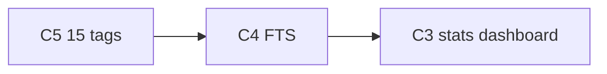

# План минимальных правок после аудита ТЗ

Документ — **минимальный diff** для закрытия оставшихся расхождений с чеклистом.  
Источник: аудит 2026-06-20; **актуализация 2026-06-20** — сверка с scope проекта (multi-user + опциональный single-user).

**Scope проекта:** основной режим — **multi-user** (JWT, demo seed); **single-user** — опциональный (`APP_AUTH_ENABLED=false`), функционал и деплой описаны в README/ARCHITECTURE.

**Принцип:** одна задача → один коммит → smoke из `for_tests.md` (секция «Compliance» после добавления).  
Не смешивать с шагами `frontend_selfreview.md` / `backend_selfreview.md`, если пользователь не попросил.

**Уже закрыто (не трогать без необходимости):** Swagger, CRUD, теги/облако, избранное, версии, wiki+граф, экспорт MD/PDF, корзина 30 дней, автосохранение, DnD между папками, ≥10 тестов, CI (typecheck+tests), README/ARCHITECTURE/REPORT, git-история, **single-user режим** (фаза 19), **demo seed при multi-user** (entrypoint `seed-demo-data --if-missing`), **запуск с клона** (фаза 21), **lint/typecheck в CI** (`vue-tsc` в build).

**Осознанные отклонения (не делаем):**

| Пункт ТЗ | Решение проекта |
|----------|-----------------|
| Split-view markdown preview | Milkdown WYSIWYG + toggle edit/preview (фаза 6); split не делать |
| Порядок заметок внутри папки | Сортировка по `updatedAt DESC` (2026-06-17); DnD reorder не планируется |
| Single-user как единственный режим | Multi-user default; single-user за `APP_AUTH_ENABLED=false` — реализован и задокументирован |
| Seed в single-user (Hogwarts) | Пустая база by design; demo-контент — через multi-user path |
| Клиентская валидация CRUD (Zod) | Частично есть; полное зеркало backend Assert — не планируется |
| Видео-демо | Опционально вне кода; не в scope |

---

## Сверка: аудит → план → статус

| Проблема аудита | Шаг | Статус |
|-----------------|:---:|--------|
| Дашборд с графиками/статистикой | C3 | ❌ открыто |
| FTS-поиск (не `LIKE`) | C4 | ❌ открыто |
| 15 тегов в demo seed (сейчас 10) | C5 | ❌ открыто |

**Minimal pass:** **C3 + C4 + C5**.

---

## Сводка: что осталось закрыть

| # | Проблема | Приоритет | Оценка diff | Статус |
|---|----------|:---------:|:-----------:|--------|
| C3 | Дашборд с графиками / статистикой | 🔴 | M | открыто |
| C4 | Полнотекстовый поиск (FTS, не `LIKE`) | 🔴 | M | открыто |
| C5 | 15 тегов в demo seed (сейчас 10) | 🟡 | S | открыто |

---

## C3 — Дашборд со статистикой и графиками

**Цель:** закрыть общее требование «дашборд с визуализацией данных», не путая с текущим списком заметок.

### Минимальный diff (вариант A — рекомендуется)

1. Новый маршрут `/stats` (минимальнее — не переименовывать `/`).
2. Backend: `GET /api/stats` для текущего пользователя:
   - `notesCount`, `foldersCount`, `tagsCount`, `linksCount`, `favoritesCount`, `trashCount`
   - `notesByFolder[]` — для bar/pie chart
   - `topTags[]` — для bar chart
   - `notesCreatedLast30Days[]` — для line chart (можно упростить до 7 точек)
3. Frontend: `StatsView.vue` + **PrimeVue Chart** — 2–3 графика + карточки KPI.
4. Текущий `DashboardView` оставить как «Заметки»; в sidebar/nav — «Статистика».

### Альтернатива B (ещё меньше diff)

- Вверху `DashboardView` блок KPI + один doughnut «заметки по папкам».

### Smoke

- `/stats`: видны цифры и минимум 2 графика; данные совпадают с demo seed (`hogwarts@demo.local`).

### Коммит

`feat(compliance): stats dashboard with charts`

---

## C4 — Полнотекстовый поиск (PostgreSQL FTS)

**Цель:** заменить `LIKE '%…%'` на полнотекстовый поиск (аналог FTS5 для PostgreSQL).

### Минимальный diff

1. Миграция: `search_vector tsvector` + GIN-индекс; локаль `simple` или `russian`.
2. `NoteRepository::search()` — `plainto_tsquery` + `ts_rank`.
3. Обновить/добавить тесты в `NoteRepositorySearchTest`.

### Коммит

`fix(compliance): PostgreSQL full-text search for notes`

---

## C5 — 15 тегов в demo seed

**Цель:** закрыть «15 тегов» в seed **на одного** demo-пользователя (multi-user path).

### Минимальный diff

1. В каждом `*Universe.php` добавить **5** тегов в массив `tags:` и назначить заметкам.
2. Пример (Potter): `школа`, `магия`, `смерть`, `дружба`, `пророчество`.

### Smoke

- После `app:seed-demo-data --force`: ≥15 тегов у `hogwarts@demo.local`.

### Коммит

`fix(compliance): extend demo seed to 15 tags per universe`

---

## Рекомендуемый порядок работ

| Шаг | Задача | Блокирует? |
|:---:|--------|:----------:|
| 1 | C5 | да (seed ТЗ) |
| 2 | C4 | да |
| 3 | C3 | да |

---

## Чеклист после minimal pass (C3+C4+C5)

- [ ] `/stats` (или аналог) — KPI + ≥2 графика
- [ ] Поиск через FTS, не `LIKE`
- [ ] Demo seed: ≥15 тегов на вселенную (проверка на `hogwarts@demo.local`)
- [ ] PHASES.md § «Вариант 5» / «Общие требования» — отметить закрытые пункты

---

## Связанные документы

- [`PHASES.md`](./PHASES.md) — фазы и статус фич
- [`demoseed.md`](./demoseed.md) — спецификация seed
- [`for_tests.md`](./for_tests.md) — smoke-сценарии
