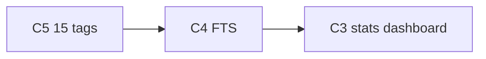

# План минимальных правок после аудита ТЗ

Документ — **минимальный diff** для закрытия оставшихся расхождений с чеклистом.  
Источник: аудит 2026-06-20; **актуализация 2026-06-20** — сверка с scope проекта (multi-user + опциональный single-user).

**Scope проекта:** основной режим — **multi-user** (JWT, demo seed); **single-user** — опциональный (`APP_AUTH_ENABLED=false`), функционал и деплой описаны в README/ARCHITECTURE.

**Принцип:** одна задача → один коммит → smoke из `for_tests.md` (секция «Compliance» после добавления).  
Не смешивать с шагами `frontend_selfreview.md` / `backend_selfreview.md`, если пользователь не попросил.

**Уже закрыто (не трогать без необходимости):** Swagger, CRUD, теги/облако, избранное, версии, wiki+граф, экспорт MD/PDF, корзина 30 дней, автосохранение, DnD между папками, ≥10 тестов, CI (typecheck+tests), README/ARCHITECTURE/REPORT, git-история, **single-user режим** (фаза 19), **demo seed** (`app:seed-demo-data`, явный вызов после `up`), **запуск с клона** (фаза 21), **lint/typecheck в CI** (`vue-tsc` в build).

**Осознанные отклонения (не делаем):**

| Пункт ТЗ | Решение проекта |
|----------|-----------------|
| Split-view markdown preview | Milkdown WYSIWYG + toggle edit/preview (фаза 6); split не делать |
| Порядок заметок внутри папки | Сортировка по `updatedAt DESC` (2026-06-17); DnD reorder не планируется |
| Single-user как единственный режим | Multi-user default; single-user за `APP_AUTH_ENABLED=false` — реализован и задокументирован |
| Seed в single-user (Hogwarts) | Пустая база by design; demo-контент — через multi-user path |
| Клиентская валидация CRUD (Zod) | Частично есть; полное зеркало backend Assert — не планируется |
| Видео-демо | Опционально вне кода; не в scope |

---

## Сверка: аудит → план → статус

| Проблема аудита | Шаг | Статус |
|-----------------|:---:|--------|
| Дашборд с графиками/статистикой | C3 | ✅ закрыто |
| FTS-поиск (не `LIKE`) | C4 | ✅ закрыто (smoke — в `for_tests.md`) |
| 15 тегов в demo seed (сейчас 10) | C5 | ✅ закрыто |

**Minimal pass:** **C3 + C4 + C5**.

---

## Сводка: что осталось закрыть

| # | Проблема | Приоритет | Оценка diff | Статус |
|---|----------|:---------:|:-----------:|--------|
| C3 | Дашборд с графиками / статистикой | 🔴 | M | ✅ закрыто |
| C4 | Полнотекстовый поиск (FTS, не `LIKE`) | 🔴 | M | ✅ закрыто |
| C5 | 15 тегов в demo seed (сейчас 10) | 🟡 | S | ✅ закрыто |

---

## C3 — Дашборд со статистикой и графиками

**Цель:** закрыть общее требование «дашборд с визуализацией данных», не путая со списком заметок на `/`.

### Реализовано (2026-06-20)

1. **`GET /api/stats`** — KPI + `notesByFolder[]` + `topTags[]` (top 8).
2. **`/stats`** (`StatsView.vue` + `DashboardStatsPanel`) — 6 KPI, doughnut, bar (PrimeVue Chart + `chart.js`).
3. **`DashboardView` (`/`)** — только карточки заметок; статистики нет.
4. **Сайдбар:** hover-кнопка «Статистика» у строки настроек аккаунта (`SidebarFooter`).
5. **Графики:** клик по папке/тегу → `/` с соответствующим фильтром.

### Исходный план (архив)

Варианты A/B из первоначального плана

**A:** `/stats` + пункт «Статистика» в nav.  
**B:** KPI + один doughnut вверху `DashboardView`.  
Фактически принят **A** (без отдельного пункта nav — hover у настроек).

### Smoke

- `/stats`: KPI + ≥2 графика; demo `hogwarts@demo.local`.
- Клик по сегменту/тегу → список заметок с фильтром.
- На `/` блок статистики отсутствует.

### Коммит

`feat(compliance): stats dashboard with charts`

---

## C4 — Полнотекстовый поиск (PostgreSQL FTS)

**Цель:** заменить `LIKE '%…%'` на полнотекстовый поиск (аналог FTS5 для PostgreSQL).

### Реализовано (2026-06-20)

**Решения:** локаль `russian`; сортировка `updatedAt DESC` (без `ts_rank`); `GET /api/notes?title=` — ILIKE (wiki-модалка); minimal scope.

1. Миграция `Version20260620120000`: `search_vector tsvector GENERATED ALWAYS` (`to_tsvector('russian', title || content)`) + GIN.
2. `NoteRepository::search()` — `to_tsquery('russian', 'token:* & …')` (префикс по лексемам, мин. 3 символа на токен).
3. Тесты: `NoteRepositorySearchTest`, `NoteSearchCaseInsensitiveTest` (PHPUnit).

### Исходный план (архив)

Минимальный diff из первоначального плана

1. Миграция: `search_vector tsvector` + GIN-индекс; локаль `simple` или `russian`.
2. `NoteRepository::search()` — `plainto_tsquery` + `ts_rank`.
3. Обновить/добавить тесты в `NoteRepositorySearchTest`.

### Smoke

- SearchBar: полные слова (`хогвартс`, `патронус`) и **префикс** (`факульт` → «факультет»); не имена тегов.
- Регистронезависимость; поиск + папка/теги; wiki-модалка — ILIKE по title.

### Коммит

`fix(compliance): PostgreSQL full-text search for notes`

---

## C5 — 15 тегов в demo seed

**Цель:** закрыть «15 тегов» в seed **на одного** demo-пользователя (multi-user path).

### Реализовано (2026-06-20)

1. В каждом `*Universe.php` добавлены **5** тегов в массив `tags:` (итого **15** на вселенную).
2. Новые теги назначены существующим заметкам (Potter: `школа`, `магия`, `смерть`, `дружба`, `пророчество`; Westeros: `трон`, `зима`, `корона`, `предательство`, `долг`; Witcher: `судьба`, `монстр`, `серебро`, `мутация`, `путь`).

### Исходный план (архив)

### Smoke

- [x] После `app:seed-demo-data --force`: ≥15 тегов у `hogwarts@demo.local` (подтверждено 2026-06-20)

### Коммит

`fix(compliance): extend demo seed to 15 tags per universe`

---

## Рекомендуемый порядок работ

| Шаг | Задача | Блокирует? |
|:---:|--------|:----------:|
| 1 | C5 | да (seed ТЗ) |
| 2 | C4 | да |
| 3 | C3 | да |

---

## Чеклист после minimal pass (C3+C4+C5)

- [x] `/stats` — KPI + ≥2 графика; smoke подтверждён (2026-06-20)
- [ ] Поиск через FTS, не `LIKE` — реализовано; smoke в `for_tests.md` § C4
- [x] Demo seed: ≥15 тегов на вселенную (smoke подтверждён 2026-06-20)
- [ ] PHASES.md § «Вариант 5» / «Общие требования» — отметить закрытые пункты

---

## Связанные документы

- [`PHASES.md`](./PHASES.md) — фазы и статус фич
- [`demoseed.md`](./demoseed.md) — спецификация seed
- [`for_tests.md`](./for_tests.md) — smoke-сценарии
