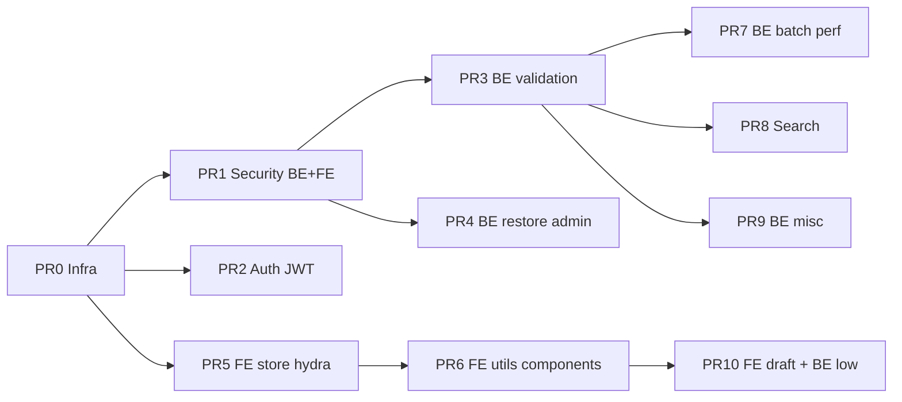

# План автотестов: PR / спринты

Разбивка реализации автотестов (фаза 21+) на reviewable PR.  
Детальные спецификации кейсов — в [`future_autotests.md`](./future_autotests.md).  
Ручной smoke — в [`for_tests.md`](./for_tests.md).

**Статус:** реализовано (ветки `test/*`, см. таблицу прогресса).

---

## Принципы

| Правило | Зачем |
|---------|--------|
| **PR0 — только инфра** | Остальные PR не тащат `phpunit.xml` / `vitest.config` |
| **Shared BE fixtures один раз в PR0–PR1** | `UserFactory`, `ApiTestCase` — переиспользование без копипасты |
| **Security рано (PR1–PR2)** | IDOR + XSS + JWT — максимальный ROI |
| **Low-priority в конце (PR9–PR10)** | Индексы, headers, EXPLAIN — не блокируют MVP CI |
| **Один PR ≈ 1–3 test-класса / 1 тема** | Review ~30–60 мин |

---

## Карта зависимостей



---

## PR0 — Test infrastructure

- [ ] **PR merged**

**Ветка:** `test/infra-phpunit-vitest`  
**Коммит:** `test: add PHPUnit and Vitest infrastructure`

### Scope

- **BE:** `symfony/test-pack`, `phpunit.xml.dist`, `.env.test`, test DB `_test`
- **BE:** базовый `ApiTestCase` (kernel boot, HTTP client, JWT helper)
- **BE:** `UserFactory` — user A/B, пароль, опционально `createWithNotes()`
- **FE:** `vitest`, `happy-dom`, `vitest.config.ts`, alias `@`, скрипт `npm test`
- **CI (если есть):** `docker compose exec php php bin/phpunit`, `docker compose exec node npm test`

### Файлы

```
backend/phpunit.xml.dist
backend/.env.test
backend/tests/Functional/ApiTestCase.php
backend/tests/Factory/UserFactory.php
frontend/vitest.config.ts
frontend/package.json  (+ test script)
```

### Критерий merge

- [ ] Пустой smoke-тест проходит на BE и FE (`assertTrue(true)` или минимальный fixture test)

---

## PR1 — Security: IDOR + XSS

- [ ] **PR merged**

**Ветка:** `test/be-idor-fe-xss`  
**Коммит:** `test(security): IDOR ownership and FE XSS utils`

| Сторона | Набор | Приоритет | Кейсов |
|---------|-------|-----------|--------|
| BE | IDOR — item только для владельца | **critical** | ~15 |
| FE | escapeHtml + highlightMatch | medium | 3 |
| FE | sanitize markdown HTML | medium | 3 |

**Спецификация:** [`future_autotests.md`](./future_autotests.md) — «BE IDOR», «FE XSS», «FE sanitize markdown».

### Файлы

```
backend/tests/Functional/ResourceOwnershipTest.php
frontend/src/utils/__tests__/escapeHtml.test.ts
frontend/src/utils/__tests__/highlightMatch.test.ts
frontend/src/utils/__tests__/sanitizeMarkdownHtml.test.ts
```

### Закрывает selfreview / smoke

- BE шаг 1 (IDOR → автотест вместо ручного A/B)
- FE шаги 1–2

### Критерий merge

- [ ] Все чужие UUID → **404**, не 403
- [ ] XSS-строки не попадают в HTML как исполняемый код

---

## PR2 — Auth: JWT refresh (BE + FE)

- [ ] **PR merged**

**Ветка:** `test/auth-jwt-refresh`  
**Коммит:** `test(auth): JWT refresh flow on backend and frontend`

| Сторона | Набор | Кейсов |
|---------|-------|--------|
| BE | JWT refresh flow | 5 |
| BE | Register — дубликат email | 3 |
| FE | JWT refresh interceptor | 4 |

**Спецификация:** «BE JWT refresh», «BE register», «FE JWT refresh interceptor».

### Файлы

```
backend/tests/Functional/JwtRefreshTest.php
backend/tests/Functional/AuthRegisterTest.php
frontend/src/api/__tests__/client.refresh.test.ts
```

### Закрывает

- BE шаги 5, 15
- FE шаг 5

### Зависимости

- PR0 (`ApiTestCase`, login helper)

---

## PR3 — BE API validation & surface

- [ ] **PR merged**

**Ветка:** `test/be-owned-relations-narrow-api`  
**Коммит:** `test(backend): owned relations, narrow API, PATCH sync`

| Набор | Кейсов |
|-------|--------|
| Owned relations (folder, tags, parent) | 7 |
| Сузить API — removed endpoints | 9+ |
| PATCH sync + settings validation | 5 |

**Спецификация:** «BE owned relations», «BE сузить API», «BE PATCH sync и settings».

### Файлы

```
backend/tests/Functional/OwnedRelationValidationTest.php
backend/tests/Functional/NarrowApiSurfaceTest.php
backend/tests/Functional/NotePatchSyncTest.php
backend/tests/Functional/UserSettingsValidationTest.php
```

### Закрывает

- BE шаги 2, 11, 12

### Зависимости

- PR1 fixtures (user A/B, folder/tag/note)

---

## PR4 — BE restore & admin guards

- [ ] **PR merged**

**Ветка:** `test/be-restore-admin`  
**Коммит:** `test(backend): version restore wiki sync and admin guards`

| Набор | Кейсов |
|-------|--------|
| Sync wiki-ссылок после restore | 4 |
| Admin self-delete / self-demote | 7 |

**Спецификация:** «BE sync wiki-ссылок после restore», «BE admin guards».

### Файлы

```
backend/tests/Functional/RestoreVersionWikiLinksTest.php
backend/tests/Functional/AdminSelfManagementTest.php
```

### Закрывает

- BE шаги 3, 4

### Зависимости

- PR1–PR3 (notes, versions, wiki links)

---

## PR5 — FE Pinia store + Hydra

- [ ] **PR merged**

**Ветка:** `test/fe-notes-store-hydra`  
**Коммит:** `test(frontend): notes store errors and hydra parsing`

| Набор | Кейсов |
|-------|--------|
| Notes store — list/detail/error | 12 |
| parseHydraCollection | 4 |
| fetchPaginatedList dedup | 3 |

**Спецификация:** «FE notes store», «FE parseHydraCollection», «FE fetchPaginatedList dedup».

### Файлы

```
frontend/src/stores/__tests__/notes.store.test.ts
frontend/src/stores/__tests__/fixtures/notes.ts
frontend/src/stores/__tests__/notes.paginated.test.ts
frontend/src/utils/__tests__/hydra.test.ts
```

### Закрывает

- FE шаги 6, 8, 10

### Зависимости

- PR0 (Vitest + Pinia setup)

---

## PR6 — FE utils & LinkNoteModal

- [ ] **PR merged**

**Ветка:** `test/fe-utils-link-modal`  
**Коммит:** `test(frontend): shared utils and LinkNoteModal searchByTitle`

| Набор | Кейсов |
|-------|--------|
| Shared utils (filters, folders, date, pluralize) | 4 |
| LinkNoteModal — searchByTitle | 2 |

**Спецификация:** «FE shared utils», «FE LinkNoteModal — searchByTitle».

### Файлы

```
frontend/src/utils/__tests__/filters.test.ts
frontend/src/utils/__tests__/folders.test.ts
frontend/src/utils/__tests__/date.test.ts
frontend/src/utils/__tests__/pluralize.test.ts
frontend/src/components/.../__tests__/LinkNoteModal.test.ts
```

### Закрывает

- FE шаги 7, 9

---

## PR7 — BE batch & read metadata

- [ ] **PR merged**

**Ветка:** `test/be-batch-preview-metadata`  
**Коммит:** `test(backend): batch statistics, wiki preview, read metadata`

| Набор | Тип | Кейсов |
|-------|-----|--------|
| Batch admin statistics | unit + optional functional | 4 |
| Batch wiki title preview | unit + functional | 8+ |
| Combine note read metadata | unit + functional | 6 |

**Спецификация:** «BE batch admin statistics», «BE batch wiki title preview», «BE combine note read metadata».

### Файлы

```
backend/tests/Unit/Repository/UserRepositoryStatisticsTest.php
backend/tests/Functional/AdminUsersListTest.php          (optional)
backend/tests/Unit/Service/NotePreviewServiceTest.php
backend/tests/Functional/NoteListPreviewTest.php
backend/tests/Unit/Repository/NoteLinkRepositoryMetadataTest.php
backend/tests/Functional/NoteReadMetadataTest.php
```

### Закрывает

- BE шаги 6, 7, 8

### Примечание

- Functional SQL-count asserts — опционально в этом PR или вынести в PR9

---

## PR8 — Case-insensitive search (BE + FE)

- [ ] **PR merged**

**Ветка:** `test/search-case-insensitive`  
**Коммит:** `test: case-insensitive note search backend and highlight`

| Сторона | Кейсов |
|---------|--------|
| BE `/search?q=` + `?title=` | 9 |
| BE unit `NoteRepository::search` | 2 |
| FE highlightMatch (case) | 2 |
| FE LinkNoteModal component (optional) | 3 |

**Спецификация:** «BE/FE регистронезависимый поиск заметок».

### Файлы

```
backend/tests/Functional/NoteSearchCaseInsensitiveTest.php
backend/tests/Unit/Repository/NoteRepositorySearchTest.php
frontend/src/utils/__tests__/highlightMatch.test.ts       (расширить PR1)
frontend/src/components/.../__tests__/LinkNoteModal.search.test.ts  (optional)
```

### Закрывает

- Backlog «регистронезависимый поиск»

### Зависимости

- PR1 (highlightMatch base), PR6 (LinkNoteModal base) — если делаете component-тесты

---

## PR9 — BE misc (graph, trash, create validation)

- [ ] **PR merged**

**Ветка:** `test/be-graph-trash-create`  
**Коммит:** `test(backend): graph batch, trash cleanup, note create validation`

| Набор | Кейсов |
|-------|--------|
| Graph API + batch unit | 3 |
| POST notes — обязательный content | 3 |
| Cleanup trash command | 2 |

**Спецификация:** «BE мелкие улучшения — trash, graph batch, content on create».

### Файлы

```
backend/tests/Functional/NoteGraphApiTest.php
backend/tests/Functional/NoteCreateValidationTest.php
backend/tests/Integration/Command/CleanupTrashCommandTest.php
backend/tests/Unit/Service/NoteGraphServiceBatchTest.php
```

### Закрывает

- BE шаг 14 (BE-часть)

---

## PR10 — FE draft + BE low-priority

- [ ] **PR merged**

**Ветка:** `test/fe-draft-be-low-priority`  
**Коммит:** `test: draft note POST guard, indexes migration, security headers`

| Сторона | Набор | Приоритет |
|---------|-------|-----------|
| FE | Черновик — POST только с content | low |
| BE | Индексы миграции | low |
| BE | Security headers + OpenAPI title | low |

**Спецификация:** «FE черновик — POST только с непустым content», «BE индексы», «BE security headers».

### Файлы

```
frontend/src/utils/__tests__/note.test.ts
frontend/src/views/__tests__/NoteView.draft.test.ts
backend/tests/Integration/Migrations/NotesIndexesMigrationTest.php
backend/tests/Functional/SecurityHeadersTest.php
```

### Закрывает

- BE шаги 9, 13, 14 (FE-часть)

---

## Сводка по спринтам

| Спринт | PR | Фокус | ~Кейсов | Review size |
|--------|-----|-------|---------|-------------|
| **S1** | PR0 | Инфра | 2 smoke | S |
| **S1** | PR1 | Security IDOR + XSS | ~21 | M |
| **S2** | PR2 | Auth JWT | ~12 | S |
| **S2** | PR3 | BE validation & API surface | ~21 | M |
| **S3** | PR4 | Restore + admin | ~11 | S |
| **S3** | PR5 | FE store + hydra | ~19 | M |
| **S4** | PR6 | FE utils + modal | ~6 | S |
| **S4** | PR7 | BE batch/perf | ~18 | L |
| **S5** | PR8 | Search backlog | ~16 | M |
| **S5** | PR9 + PR10 | Misc + low | ~12 | M |

**Итого:** 10 PR, ~25 test-файлов, ~130+ кейсов.

---

## CI после каждого PR

```bash
# Backend
docker compose exec php php bin/phpunit

# Frontend
docker compose exec node npm test
```

После merge PR0 — добавить оба шага в CI; дальше каждый PR только расширяет suite.

---

## Чеклист перед стартом PR0

- [ ] `docker compose up -d`
- [ ] Test DB: `DATABASE_URL` с `_test` в `.env.test`
- [ ] Symlink `frontend/node_modules` → `volumes/node_modules` (для IDE)
- [ ] Обновить `PHASES.md` / `REPORT.md` при merge PR0

---

## Не покрываем (по selfreview)

| Шаг | Причина |
|-----|---------|
| BE 10 | dead code |
| FE 3–4 | deps/chore |
| FE 11–14 | refactor follow-up |

Полная таблица selfreview → спецификации: [`future_autotests.md`](./future_autotests.md) (раздел «Сводка»).

---

## Прогресс PR (сводка)

| PR | Название | Статус |
|----|----------|--------|
| PR0 | Test infrastructure | ✅ `test/infra-phpunit-vitest` |
| PR1 | Security: IDOR + XSS | ✅ `test/be-idor-fe-xss` |
| PR2 | Auth: JWT refresh | ✅ `test/auth-jwt-refresh` |
| PR3 | BE API validation & surface | ✅ `test/be-owned-relations-narrow-api` |
| PR4 | BE restore & admin guards | ✅ `test/be-restore-admin` |
| PR5 | FE Pinia store + Hydra | ✅ `test/fe-notes-store-hydra` |
| PR6 | FE utils & LinkNoteModal | ✅ `test/fe-utils-link-modal` |
| PR7 | BE batch & read metadata | ✅ `test/be-batch-preview-metadata` |
| PR8 | Case-insensitive search | ✅ `test/search-case-insensitive` |
| PR9 | BE misc (graph, trash, create) | ✅ `test/be-graph-trash-create` |
| PR10 | FE draft + BE low-priority | ✅ `test/fe-draft-be-low-priority` |

Заменить ⬜ на ✅ после merge соответствующего PR.
